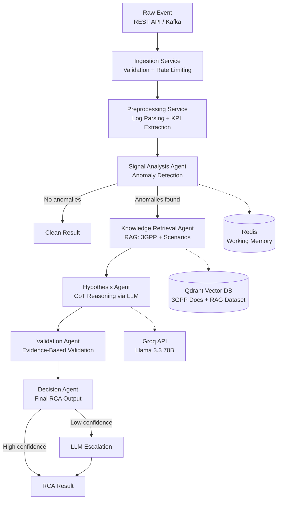

# 5G gNB RCA Multi-Agent Orchestrator — Complete Repository Walkthrough

## 1. What This Project Does

This is an **AI-powered Root Cause Analysis (RCA) system for 5G gNodeB (gNB) networks**. It's an 8th-semester Major Project that automates the diagnosis of network faults by combining:

- **Multi-Agent Orchestration** — A 5-agent pipeline where each agent has a distinct role in the reasoning process
- **Retrieval-Augmented Generation (RAG)** — Retrieves relevant 3GPP specifications and historical scenario data to ground the analysis in domain knowledge
- **Chain-of-Thought (CoT) Reasoning** — Uses structured step-by-step reasoning via LLMs to generate explainable hypotheses
- **Tiered Inference Routing** — Routes requests through SLMs (Small Language Models) and escalates to larger models when confidence is low

When a 5G network event comes in (e.g., "cell X has low SINR and high interference"), the system automatically identifies the **root cause** (interference, handover failure, resource congestion, hardware fault, etc.), provides **supporting evidence**, a **reasoning trace**, and **recommended remediation actions**.

---

## 2. High-Level Architecture

```
┌─────────────────┐     ┌──────────────────┐     ┌──────────────────────────────────────┐
│  Kafka / REST   │────▶│  Ingestion       │────▶│       Multi-Agent Orchestrator       │
│  (Raw Events)   │     │  + Preprocessing │     │                                      │
└─────────────────┘     └──────────────────┘     │  Signal → Knowledge → Hypothesis     │
                                                 │           → Validation → Decision    │
                                                 └──────────────┬───────────────────────┘
                                                                │
                                          ┌─────────────────────┼─────────────────────┐
                                          ▼                     ▼                     ▼
                                    ┌──────────┐          ┌──────────┐          ┌──────────┐
                                    │  RAG     │          │  SLM     │          │  LLM     │
                                    │Qdrant    │          │(Groq)    │          │(Fallback)│
                                    └──────────┘          └──────────┘          └──────────┘
```



---

## 3. Project Structure — File-by-File

### Root Level

| File | Purpose |
|------|---------|
| [main.py](file:///c:/Users/krupa/Desktop/8th_sem_Major_Project/Agent_v3/Agent/main.py) | Entry point — starts the FastAPI server via uvicorn |
| [requirements.txt](file:///c:/Users/krupa/Desktop/8th_sem_Major_Project/Agent_v3/Agent/requirements.txt) | Python dependencies (FastAPI, Qdrant, sentence-transformers, Redis, etc.) |
| [setup.py](file:///c:/Users/krupa/Desktop/8th_sem_Major_Project/Agent_v3/Agent/setup.py) | `pip install -e .` support for internal imports |
| [docker-compose.yml](file:///c:/Users/krupa/Desktop/8th_sem_Major_Project/Agent_v3/Agent/docker-compose.yml) | Infrastructure stack: Redis, MongoDB, Qdrant |
| [Dockerfile](file:///c:/Users/krupa/Desktop/8th_sem_Major_Project/Agent_v3/Agent/Dockerfile) | Container image for the API server |
| [.env](file:///c:/Users/krupa/Desktop/8th_sem_Major_Project/Agent_v3/Agent/.env) | Environment variables (all config knobs) |
| [pytest.ini](file:///c:/Users/krupa/Desktop/8th_sem_Major_Project/Agent_v3/Agent/pytest.ini) | Test configuration (asyncio mode) |

---

## 4. Configuration Layer — `config/`

### [settings.py](file:///c:/Users/krupa/Desktop/8th_sem_Major_Project/Agent_v3/Agent/config/settings.py)

Uses **Pydantic Settings** to load configuration from `.env` with typed defaults. Key groups:

| Config Group | Key Settings | Purpose |
|---|---|---|
| **Application** | `app_port=8000`, `app_debug` | Server binding |
| **Redis** | `redis_url`, `redis_working_memory_ttl=3600` | Inter-agent shared memory |
| **Qdrant** | `qdrant_host`, `qdrant_collection="3gpp_knowledge"`, `qdrant_rag_collection="5g_rag_dataset"` | Two vector DB collections |
| **Inference** | `slm_model="llama-3.3-70b-versatile"`, `ollama_base_url` | LLM model selection |
| **Embedding** | `embedding_model="BAAI/bge-small-en-v1.5"`, `embedding_dimension=384` | Sentence transformer |
| **RAG** | `rag_top_k=5`, `rag_max_hops=2`, `rag_similarity_threshold=0.7` | Retrieval tuning |
| **Agent** | `agent_confidence_threshold=0.75`, `agent_escalation_threshold=0.5` | When to escalate to LLM |

The `get_settings()` function uses `@lru_cache` for a singleton pattern.

---

## 5. Data Models — `models/`

### [schemas.py](file:///c:/Users/krupa/Desktop/8th_sem_Major_Project/Agent_v3/Agent/models/schemas.py)

This is the **canonical data contract** for the entire system. All Pydantic models are defined here:

#### Enumerations
- **`RootCauseCategory`** — The 7 possible root causes: `interference`, `handover_failure`, `resource_congestion`, `hardware_fault`, `software_fault`, `configuration_error`, `unknown`
- **`AgentType`** — The 5 agents: signal, knowledge, hypothesis, validation, decision
- **`MessageType`** — Inter-agent message types: observation, hypothesis, evidence, decision
- **`Severity`** — critical, warning, normal, info

#### Core Models

| Model | Purpose |
|-------|---------|
| `RawLogEvent` | Raw log event as received from sources (Kafka/API) |
| `KPIMetrics` | 15 5G KPI metrics (SINR, RSRP, RSRQ, PRB util, BLER, handover rate, throughput, latency, etc.) |
| `ProcessedEvent` | Fully processed event with KPIs, anomaly scores, cell context |
| `AgentMessage` | Structured message passed between agents with confidence scores and reasoning steps |
| `Hypothesis` | A single root cause hypothesis with supporting/contradicting evidence |
| `ReasoningStep` | One step in the reasoning trace (agent, action, observation, conclusion, confidence) |
| `RCAResult` | **The final output** — root cause, confidence, reasoning trace, evidence, recommended actions, and diagnostic telemetry details (kpis, anomalies, correlations, alternative hypotheses) |
| `RAGQuery` / `RAGChunk` / `RAGResult` | RAG retrieval data contracts |
| `AnalyzeRequest` / `AnalyzeResponse` | API request/response models |
| `InferenceRequest` / `InferenceResponse` | LLM inference contracts |

---

## 6. Services Layer — `services/`

### 6.1 API Gateway — `services/api/`

#### [app.py](file:///c:/Users/krupa/Desktop/8th_sem_Major_Project/Agent_v3/Agent/services/api/app.py)
- Creates the FastAPI application with **lifespan management**
- On startup: initializes the `OrchestratorGraph`, auto-ingests JSONL RAG datasets into Qdrant if the collection is empty
- Adds **CORS middleware** (allow all origins) and a custom **rate limiting middleware**
- Mounts all routes under `/api/v1`

#### [routes.py](file:///c:/Users/krupa/Desktop/8th_sem_Major_Project/Agent_v3/Agent/services/api/routes.py)
Key endpoints:

| Method | Endpoint | What it does |
|--------|----------|-------------|
| `POST` | `/api/v1/analyze` | Run single-event RCA through the full agent pipeline |
| `POST` | `/api/v1/analyze/batch` | Batch analysis (up to 50 events) |
| `GET` | `/api/v1/health` | Health check with service statuses |
| `GET` | `/api/v1/metrics` | Orchestrator performance metrics |
| `POST` | `/api/v1/feedback` | Human operator feedback on RCA results |
| `POST` | `/api/v1/knowledge/ingest` | Ingest plain-text 3GPP docs from `knowledge/` |
| `POST` | `/api/v1/knowledge/ingest-datasets` | Ingest JSONL RAG datasets from `data/` |

#### [middleware.py](file:///c:/Users/krupa/Desktop/8th_sem_Major_Project/Agent_v3/Agent/services/api/middleware.py)
Token-bucket rate limiter as ASGI middleware (100 requests/minute default).

---

### 6.2 Ingestion Service — `services/ingestion/`

#### [service.py](file:///c:/Users/krupa/Desktop/8th_sem_Major_Project/Agent_v3/Agent/services/ingestion/service.py)
Accepts raw log events from **three sources**:
- **REST API** — `ingest_single()`, `ingest_batch()`
- **Kafka streaming** — `consume_stream()` using `aiokafka`
- Batch imports (S3) — planned

Pipeline: **Receive → Rate Limit → Schema Validate → Publish to Kafka**

#### [schema_validator.py](file:///c:/Users/krupa/Desktop/8th_sem_Major_Project/Agent_v3/Agent/services/ingestion/schema_validator.py)
Validates incoming events for required fields, timestamp sanity, message length, etc.

#### [rate_limiter.py](file:///c:/Users/krupa/Desktop/8th_sem_Major_Project/Agent_v3/Agent/services/ingestion/rate_limiter.py)
Token-bucket rate limiter per source (10K events/sec, 20K burst).

---

### 6.3 Preprocessing Service — `services/preprocessing/`

#### [service.py](file:///c:/Users/krupa/Desktop/8th_sem_Major_Project/Agent_v3/Agent/services/preprocessing/service.py)
6-stage pipeline:

1. **Parse** raw log message using hybrid log parser
2. **Extract KPIs** from the parsed message
3. **Identify cell/gNB** from metadata or parsed parameters
4. **Detect anomalies** — computes anomaly scores (0.0–1.0) for each KPI based on threshold distance
5. **Build context** — neighboring cells, frequency band, bandwidth
6. **Emit** a `ProcessedEvent`

#### [log_parser.py](file:///c:/Users/krupa/Desktop/8th_sem_Major_Project/Agent_v3/Agent/services/preprocessing/log_parser.py)
Hybrid parser using regex-based template matching. Extracts event types (handover, interference, congestion, etc.) and key parameters.

#### [kpi_extractor.py](file:///c:/Users/krupa/Desktop/8th_sem_Major_Project/Agent_v3/Agent/services/preprocessing/kpi_extractor.py)
Extracts 15 KPI values from log messages using regex patterns and contextual parsing.

---

### 6.4 RAG Service — `services/rag/`

This is the **knowledge retrieval backbone** of the system.

#### [service.py](file:///c:/Users/krupa/Desktop/8th_sem_Major_Project/Agent_v3/Agent/services/rag/service.py)
Unified facade that combines embedding, retrieval, and ingestion:
- `retrieve(query)` — Searches **both** Qdrant collections and returns merged, ranked results
- `ingest_knowledge_base()` — Ingests plain-text 3GPP docs
- `ingest_jsonl_datasets()` — Ingests JSONL scenario data
- `format_context()` — Formats retrieved chunks for LLM prompting with token budget

#### [embeddings.py](file:///c:/Users/krupa/Desktop/8th_sem_Major_Project/Agent_v3/Agent/services/rag/embeddings.py)
- Uses **`BAAI/bge-small-en-v1.5`** (384-dim) via `sentence-transformers`
- Lazy-loads the model on first use
- In-memory cache (up to 10K entries) for repeated queries
- Supports batch encoding with cache-awareness

#### [retriever.py](file:///c:/Users/krupa/Desktop/8th_sem_Major_Project/Agent_v3/Agent/services/rag/retriever.py)
**Multi-collection dense retrieval**:
1. Encodes the query with the embedding model
2. Searches the **`3gpp_knowledge`** collection (plain-text 3GPP docs)
3. Searches the **`5g_rag_dataset`** collection (JSONL scenario data)
4. **Merges** results by cosine similarity score
5. Applies similarity threshold (0.7) — falls back to unfiltered if nothing passes
6. Returns top-k chunks
7. Results are cached per query

#### [knowledge_base.py](file:///c:/Users/krupa/Desktop/8th_sem_Major_Project/Agent_v3/Agent/services/rag/knowledge_base.py)
Handles document ingestion and indexing:

**Plain-text ingestion** (`knowledge/` directory):
1. Reads `.txt` and `.md` files
2. Splits into sections based on headings
3. Chunks each section (512 tokens, 64 overlap)
4. Generates embeddings via `sentence-transformers`
5. Upserts into **Qdrant** (`3gpp_knowledge` collection)
6. Also indexes in **Elasticsearch** for BM25 sparse search (if available)

**JSONL ingestion** (`data/` directory):
1. Reads pre-chunked JSONL files
2. Each line = one chunk with `content`, `chunk_type`, `scenario_id`, `metadata`
3. Embeds in batches of 64
4. Upserts into **Qdrant** (`5g_rag_dataset` collection)

---

### 6.5 Inference Service — `services/inference/`

This handles all LLM/SLM communication.

#### [service.py](file:///c:/Users/krupa/Desktop/8th_sem_Major_Project/Agent_v3/Agent/services/inference/service.py)
Unified interface: `generate(prompt, system_prompt, ...)` → routes through the router, then calibrates the confidence score.

#### [router.py](file:///c:/Users/krupa/Desktop/8th_sem_Major_Project/Agent_v3/Agent/services/inference/router.py)
Currently simplified: **all inference goes through the SLM client** (Groq). The `force_llm` parameter exists for API compatibility but routes to the same model.

#### [slm_client.py](file:///c:/Users/krupa/Desktop/8th_sem_Major_Project/Agent_v3/Agent/services/inference/slm_client.py)
**Primary inference client** — uses the **Groq API** (OpenAI-compatible):
- Model: **`llama-3.3-70b-versatile`** (configurable)
- Uses `openai.AsyncOpenAI` pointed at `https://api.groq.com/openai/v1`
- Includes heuristic **confidence estimation** based on response quality signals (presence of reasoning keywords, response length, JSON structure)
- Handles timeouts and errors gracefully

#### [llm_client.py](file:///c:/Users/krupa/Desktop/8th_sem_Major_Project/Agent_v3/Agent/services/inference/llm_client.py)
Fallback LLM client using **local Ollama** API. Sends HTTP requests to `http://localhost:11434/api/chat`. Currently not in the active routing path but available for escalation.

#### [confidence_calibrator.py](file:///c:/Users/krupa/Desktop/8th_sem_Major_Project/Agent_v3/Agent/services/inference/confidence_calibrator.py)
**Platt scaling** for confidence calibration:
- Applies `sigmoid(a * raw_confidence + b)` transformation
- Default params: `a=1.5, b=-0.3`
- Feature-aware adjustments: more reasoning steps → higher confidence, higher RAG score → higher confidence
- Can be **fitted** from validation data using grid search to minimize Expected Calibration Error (ECE)
- Supports online learning via `add_observation()`

---

### 6.6 Orchestrator — `services/orchestrator/`

This is the **brain of the system**.

#### [graph.py](file:///c:/Users/krupa/Desktop/8th_sem_Major_Project/Agent_v3/Agent/services/orchestrator/graph.py) — Pipeline Orchestrator

The `OrchestratorGraph` class defines the execution flow:

```
Stage 1: Signal Agent        → Detect KPI anomalies
  ↓ (early exit if no anomalies)
Stage 2: Knowledge Agent     → Retrieve 3GPP docs + scenarios via RAG
  ↓
Stage 3: Hypothesis Agent    → Generate root cause hypotheses via CoT
  ↓
Stage 4: Validation Agent    → Validate hypotheses against evidence
  ↓
Stage 5: Decision Agent      → Final output (may escalate to LLM)
```

**Conditional routing**:
- If Signal Agent finds no anomalies → returns "clean result" immediately
- If Validation score < escalation threshold → Decision Agent escalates to LLM

Each stage stores its output in **working memory** so downstream agents can read upstream results.

#### [working_memory.py](file:///c:/Users/krupa/Desktop/8th_sem_Major_Project/Agent_v3/Agent/services/orchestrator/working_memory.py) — Redis-Backed Shared State

- Each RCA session gets a unique `session_id`
- Data stored as Redis hash (`wm:{session_id}`)
- **TTL-based expiration** (1 hour default)
- Graceful fallback to **local dict** if Redis is unavailable
- Operations: `store()`, `retrieve()`, `get_full_context()`, `append_to_list()`, `clear()`

---

### 6.7 Agents — `services/orchestrator/agents/`

#### [base.py](file:///c:/Users/krupa/Desktop/8th_sem_Major_Project/Agent_v3/Agent/services/orchestrator/agents/base.py) — Abstract Base

All agents inherit from `BaseAgent`:
- Abstract `execute(event, memory)` method
- `_create_message()` helper for structured `AgentMessage` creation
- Per-agent `get_metrics()` (invocation count, avg latency)

---

#### [signal_agent.py](file:///c:/Users/krupa/Desktop/8th_sem_Major_Project/Agent_v3/Agent/services/orchestrator/agents/signal_agent.py) — Stage 1: Anomaly Detection

**Purpose**: Analyzes raw KPIs and detects anomalies using threshold-based rules.

**KPI Thresholds** (based on 3GPP recommendations):

| KPI | Critical | Warning | Normal |
|-----|----------|---------|--------|
| SINR (dB) | < 0 | < 5 | < 10 |
| RSRP (dBm) | < -130 | < -120 | < -100 |
| PRB Utilization (%) | > 95 | > 85 | > 70 |
| BLER (%) | > 10 | > 5 | > 2 |
| Handover Success Rate | < 0.7 | < 0.85 | < 0.95 |
| Latency (ms) | > 100 | > 50 | > 20 |

**Cross-KPI Correlation Patterns** (4 predefined):
1. `interference_congestion` — Low SINR + High PRB → interference-induced congestion
2. `handover_signal_quality` — Low HO rate + Weak RSRP → coverage gap at cell edge
3. `overload_degradation` — High PRB + Many UEs + High latency → cell overload
4. `interference_only` — Low SINR + High interference level → external interference

**Output**: Stores anomaly report in working memory key `"signal_analysis"`.

---

#### [knowledge_agent.py](file:///c:/Users/krupa/Desktop/8th_sem_Major_Project/Agent_v3/Agent/services/orchestrator/agents/knowledge_agent.py) — Stage 2: RAG Retrieval

**Purpose**: Fetches relevant 3GPP specifications and historical 5G scenario data.

**Query Construction** — Builds domain-specific queries from:
1. Event type → template queries (e.g., `interference_detected` → "5G NR interference management procedures 3GPP")
2. Detected anomalies → KPI-specific queries (e.g., low SINR → "interference mitigation 5G NR cell")
3. Correlation patterns → standard references (e.g., → "inter-cell interference 3GPP TS 38.213")
4. Cell ID → cell-specific configuration query

**Chunk Type Classification** — Distinguishes between:
- Domain knowledge (`domain_knowledge`, `root_cause_reference`)
- Scenario evidence (`drive_test_analysis`, `signaling_analysis`, `cell_configuration`, etc.)

**Post-retrieval processing**:
- **Threshold extraction** — Finds numeric thresholds mentioned in docs (T310, N310, A3 offset, etc.)
- **Pattern matching** — Matches against 11 known failure patterns (ping-pong handover, pilot pollution, coverage hole, overshooting, etc.)
- **Formatted context** — Groups chunks into "Domain Knowledge", "Scenario Evidence", "Additional Context" sections

**Confidence formula**: `min(0.95, 0.5 + 0.08 * num_contexts + 0.05 * min(scenario_chunks, 5))`

---

#### [hypothesis_agent.py](file:///c:/Users/krupa/Desktop/8th_sem_Major_Project/Agent_v3/Agent/services/orchestrator/agents/hypothesis_agent.py) — Stage 3: CoT Reasoning

**Purpose**: Generates ranked root cause hypotheses using Chain-of-Thought reasoning via an LLM.

**System Prompt**: Instructs the LLM to act as a "5G network expert" and output structured JSON with:
- `reasoning_steps` — Step-by-step analysis
- `hypotheses[]` — Each with `root_cause`, `specific_cause`, `confidence`, `supporting_evidence`, `contradicting_evidence`

**User Prompt Template**: Includes all context from prior agents:
- Event info (cell ID, timestamp, type)
- KPI observations
- Detected anomalies
- Correlation patterns
- 3GPP knowledge context (capped at 1500 chars)
- Known failure patterns

**Robust Parsing**: 
- Extracts JSON from LLM response (handles ```json blocks, surrounding text)
- Uses brace-depth matching to find valid JSON
- Maps string root causes to `RootCauseCategory` enum

**Fallback**: If LLM response can't be parsed → generates **rule-based hypotheses** using KPI thresholds (SINR < 5 → interference, HO rate < 0.85 → handover failure, PRB > 90% → congestion).

---

#### [validation_agent.py](file:///c:/Users/krupa/Desktop/8th_sem_Major_Project/Agent_v3/Agent/services/orchestrator/agents/validation_agent.py) — Stage 4: Evidence Validation

**Purpose**: Validates each hypothesis against KPI evidence using four blended factors:

1. **LLM Hypothesis Confidence** (weight: 0.2)
   - Integrates the initial confidence score from the Hypothesis Agent (CoT LLM reasoning).

2. **Supporting Evidence Evaluation** (weight: 0.5)
   - Checks which supporting KPI conditions are met for this root cause
   - Bonus if meets minimum required evidence threshold

3. **Contradiction Checking** (weight: 0.15)
   - Checks contradicting KPI conditions (e.g., high SINR contradicts interference hypothesis)
   - Score inverted: `1 - contradiction_score`

4. **Counterfactual Reasoning** (weight: 0.15)
   - "If the hypothesized cause were removed, would the observed symptoms be explained?"
   - Checks how many anomalous KPIs the hypothesis explains

**Validation Rules** per root cause:

| Root Cause | Supporting KPIs | Contradicting KPIs | Min Evidence |
|---|---|---|---|
| Interference | SINR<5, Interference>-95, BLER>5 | SINR>15, Interference<-110 | 2 |
| Handover | HO rate<0.85, RSRP<-110, RSRQ<-15 | HO rate>0.95, RSRP>-90 | 1 |
| Congestion | PRB>85, UEs>300, Latency>50 | PRB<50, UEs<50 | 2 |
| Hardware | BLER>10 | — | 1 |
| Software Fault | Latency>100, Throughput<10, PRB<70 | PRB>90 | 1 |
| Configuration Error | RSRP<-110, HO rate<0.85, SINR<0 | HO rate>0.95 | 1 |

**Output**: Sorted list of validated hypotheses with `validation_score`.

---

#### [decision_agent.py](file:///c:/Users/krupa/Desktop/8th_sem_Major_Project/Agent_v3/Agent/services/orchestrator/agents/decision_agent.py) — Stage 5: Final Decision

**Purpose**: Produces the final `RCAResult` and handles LLM escalation.

**Escalation Logic**:
- If top hypothesis `validation_score < escalation_threshold (0.5)` → escalates to LLM
- Escalation builds a comprehensive prompt with all working memory context
- LLM acts as "senior 5G network engineer" to provide a second opinion

**Recommended Actions**: Pre-defined per root cause category (3-5 actions each), e.g.:
- Interference → "Analyze neighboring cell PCI", "Check ICIC power control", "Check antenna tilt"
- Handover → "Review A3 event threshold", "Check T310/N310 timers", "Verify NRT completeness"

**Reasoning Trace Compilation**: Assembles a 5-step `ReasoningStep` trace documenting what each agent contributed.

---

### 6.8 Evaluation Service — `services/evaluation/`

#### [service.py](file:///c:/Users/krupa/Desktop/8th_sem_Major_Project/Agent_v3/Agent/services/evaluation/service.py)
Benchmark runner that evaluates the RCA pipeline:
- Runs evaluation samples through the full pipeline
- Supports concurrent execution with semaphore-based concurrency control
- Can compare multiple models on the same dataset

#### [datasets.py](file:///c:/Users/krupa/Desktop/8th_sem_Major_Project/Agent_v3/Agent/services/evaluation/datasets.py)
Three benchmark datasets:
1. **SyntheticDataset** — Generated 5G fault scenarios with ground truth
2. **ITUChallengeDataset** — Based on ITU AI/ML challenge data
3. **LoghubDataset** — From Loghub telecom log corpus

#### [metrics.py](file:///c:/Users/krupa/Desktop/8th_sem_Major_Project/Agent_v3/Agent/services/evaluation/metrics.py)
Six evaluation metrics:

| Metric | What it measures |
|--------|-----------------|
| **Classification F1** | Root cause identification accuracy |
| **Reasoning Accuracy** | CoT step correctness |
| **Latency P95** | End-to-end response time at 95th percentile |
| **Calibration ECE** | Expected Calibration Error — are confidences reliable? |
| **Hallucination Rate** | Factual correctness of outputs |
| **Cost per Query** | API/compute costs |

---

## 7. Knowledge Base — `knowledge/`

Four plain-text files, each documenting a specific 5G fault category with:
- **Symptoms** (what operators see)
- **KPI Signatures** (which KPIs are affected and how)
- **Root Causes** (what actually causes this)
- **3GPP References** (relevant specifications)
- **Remediation** (what to do)
- **Correlation Patterns** (cross-KPI indicators)

| File | Fault Type |
|------|-----------|
| [interference.txt](file:///c:/Users/krupa/Desktop/8th_sem_Major_Project/Agent_v3/Agent/knowledge/interference.txt) | RF Interference (PCI collision, co-channel, external) |
| [handover.txt](file:///c:/Users/krupa/Desktop/8th_sem_Major_Project/Agent_v3/Agent/knowledge/handover.txt) | Handover Failures (A3 event, T310, missing neighbors) |
| [congestion.txt](file:///c:/Users/krupa/Desktop/8th_sem_Major_Project/Agent_v3/Agent/knowledge/congestion.txt) | Resource Congestion (PRB exhaustion, cell overload) |
| [hardware_fault.txt](file:///c:/Users/krupa/Desktop/8th_sem_Major_Project/Agent_v3/Agent/knowledge/hardware_fault.txt) | Hardware Faults (antenna, RRU, power supply) |

---

## 8. Data — `data/`

| File | Size | Purpose |
|------|------|---------|
| `rag_dataset.jsonl` | 7.4 MB | Primary RAG dataset — pre-chunked 5G scenarios |
| `rag_dataset_2.jsonl` | 5.3 MB | Additional RAG dataset |
| `dummy_rca_dataset.json` | 8 KB | Small test dataset |

The JSONL files contain pre-chunked records with fields like `chunk_id`, `content`, `chunk_type` (scenario_overview, drive_test_analysis, cell_configuration, etc.), `scenario_id`, and `metadata`.

---

## 9. Scripts — `scripts/`

| Script | Purpose |
|--------|---------|
| [load_knowledge.py](file:///c:/Users/krupa/Desktop/8th_sem_Major_Project/Agent_v3/Agent/scripts/load_knowledge.py) | Loads `knowledge/` docs into Qdrant |
| [ingest_rag_datasets.py](file:///c:/Users/krupa/Desktop/8th_sem_Major_Project/Agent_v3/Agent/scripts/ingest_rag_datasets.py) | Ingests JSONL datasets into Qdrant |
| [run_demo.py](file:///c:/Users/krupa/Desktop/8th_sem_Major_Project/Agent_v3/Agent/scripts/run_demo.py) | Runs a demo analysis without the API server |
| [build_rag_dataset.py](file:///c:/Users/krupa/Desktop/8th_sem_Major_Project/Agent_v3/Agent/scripts/build_rag_dataset.py) | Generates/builds the RAG dataset (24 KB) |
| [build_rag_dataset_2.py](file:///c:/Users/krupa/Desktop/8th_sem_Major_Project/Agent_v3/Agent/scripts/build_rag_dataset_2.py) | Generates the second RAG dataset (26 KB) |

---

## 10. Tests — `tests/`

| Test File | Coverage |
|-----------|----------|
| [conftest.py](file:///c:/Users/krupa/Desktop/8th_sem_Major_Project/Agent_v3/Agent/tests/conftest.py) | Shared fixtures (mock events, fake Redis, mock services) |
| [test_agents.py](file:///c:/Users/krupa/Desktop/8th_sem_Major_Project/Agent_v3/Agent/tests/test_agents.py) | All 5 agents (signal, knowledge, hypothesis, validation, decision) |
| [test_api.py](file:///c:/Users/krupa/Desktop/8th_sem_Major_Project/Agent_v3/Agent/tests/test_api.py) | FastAPI endpoints (health, analyze, metrics) |
| [test_evaluation.py](file:///c:/Users/krupa/Desktop/8th_sem_Major_Project/Agent_v3/Agent/tests/test_evaluation.py) | Evaluation metrics and dataset loading |
| [test_preprocessing.py](file:///c:/Users/krupa/Desktop/8th_sem_Major_Project/Agent_v3/Agent/tests/test_preprocessing.py) | Log parsing and KPI extraction |

---

## 11. Infrastructure — `deployment/`

- [prometheus.yml](file:///c:/Users/krupa/Desktop/8th_sem_Major_Project/Agent_v3/Agent/deployment/prometheus.yml) — Prometheus scrape config targeting `localhost:8000/api/v1/metrics`

**Docker Compose stack** provides:
- **Redis 7** — Working memory + caching (256 MB, LRU eviction)
- **MongoDB 7** — Persistent storage for RCA results (currently not actively used in code)
- **Qdrant v1.7.4** — Vector database for RAG retrieval (persistent volume)

---

## 12. End-to-End Data Flow

Here's what happens when you `POST /api/v1/analyze`:

```
1. API receives AnalyzeRequest with cell_id, KPIs, event_type
   ↓
2. Constructs a ProcessedEvent
   ↓
3. OrchestratorGraph.execute() starts
   ↓
4. Creates a WorkingMemory session (Redis hash with TTL)
   ↓
5. SIGNAL AGENT: Checks each KPI against 3GPP thresholds
   → Detects anomalies (e.g., "SINR=2dB is critical")
   → Detects cross-KPI correlations (e.g., "interference_congestion")
   → Stores in working memory as "signal_analysis"
   ↓
6. KNOWLEDGE AGENT: Builds domain queries from anomalies
   → Queries Qdrant (both 3GPP + scenario collections)
   → Extracts thresholds (T310, N310, etc.) from retrieved docs
   → Matches against known failure patterns
   → Stores in working memory as "knowledge_context"
   ↓
7. HYPOTHESIS AGENT: Builds CoT prompt with all context
   → Sends to Groq API (Llama 3.3 70B)
   → Parses JSON response into Hypothesis objects
   → Falls back to rule-based if LLM fails
   → Stores in working memory as "hypotheses"
   ↓
8. VALIDATION AGENT: For each hypothesis:
   → Evaluates supporting evidence (0.4 weight)
   → Checks contradictions (0.3 weight)
   → Counterfactual test (0.3 weight)
   → Produces weighted validation_score
   → Stores sorted list as "validated_hypotheses"
   ↓
9. DECISION AGENT: Takes top validated hypothesis
   → If validation_score < 0.5 → escalates to LLM
   → Selects recommended actions per root cause
   → Compiles full 5-step reasoning trace
   → Returns RCAResult
   ↓
10. Working memory cleared, session closed
    ↓
11. API returns AnalyzeResponse with root cause, confidence,
    reasoning trace, evidence, and recommended actions
```

---

## 13. Key Design Decisions

| Decision | Rationale |
|----------|-----------|
| **Groq API** instead of local Ollama | Groq provides fast inference for large models (Llama 3.3 70B) without needing a GPU locally |
| **Two Qdrant collections** | Separates curated 3GPP knowledge from data-driven scenario evidence |
| **Redis working memory** with local fallback | Enables distributed deployment while remaining functional without Redis |
| **Platt scaling confidence calibration** | Ensures model confidence scores are well-calibrated (low ECE) |
| **Rule-based fallback** in hypothesis agent | System degrades gracefully if LLM produces unparseable output |
| **BGE-small-en-v1.5** for embeddings | Small (384-dim), fast, good quality — suitable for real-time retrieval |
| **Pydantic models everywhere** | Strong typing and validation across all service boundaries |

> [!WARNING]
> The `.env` file contains a **Groq API key** in plaintext. This should be rotated and kept out of version control in any production deployment.
